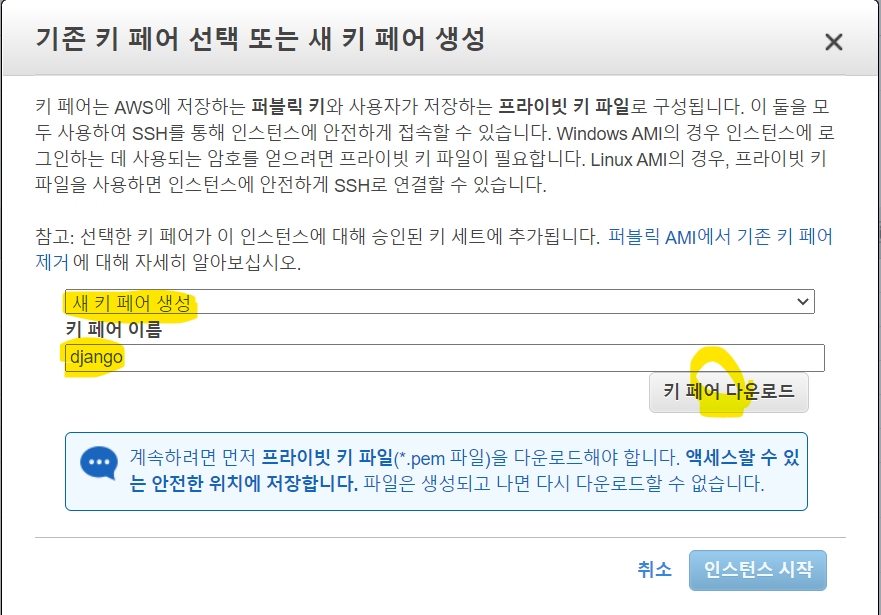
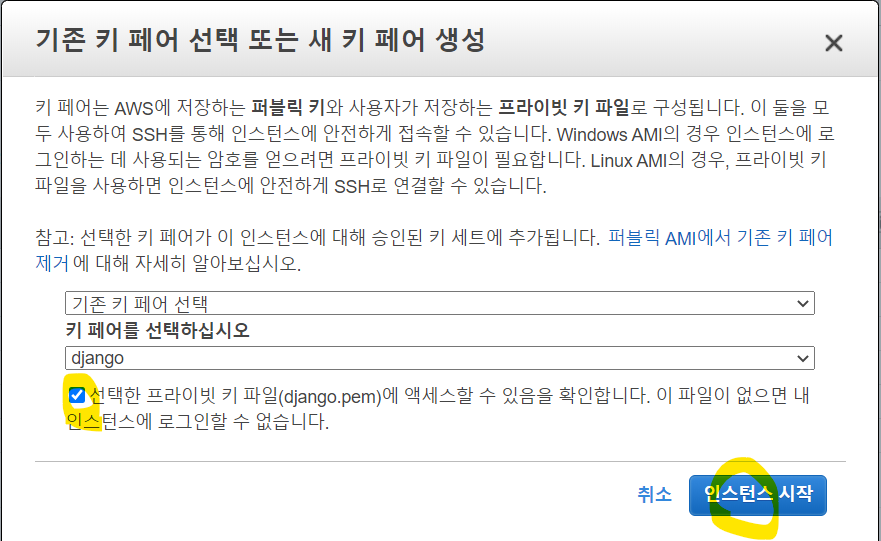
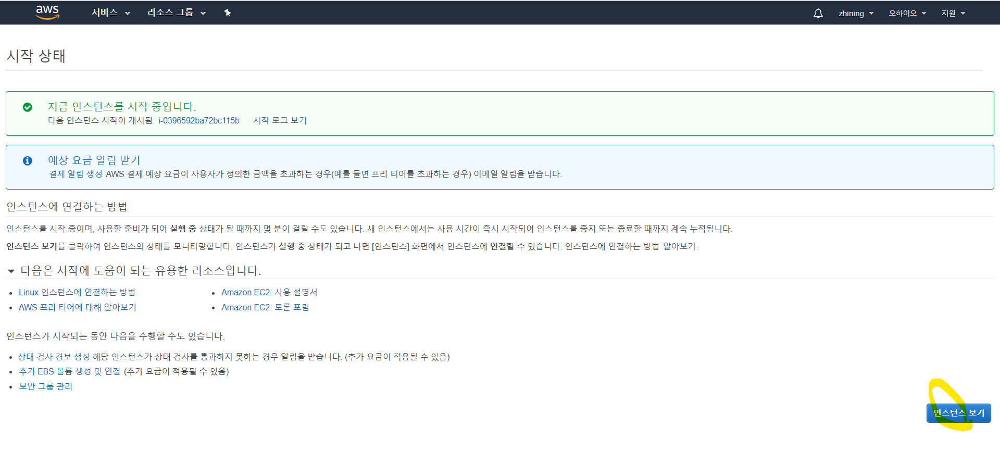

## [과정1] settings.py 수정

1. pip freeze > requirement.txt
2. git에 업로드
3. settings.py 수정
ALLOWED_HOSTS = ['*']

## [과정2] AWS 설정

1. https://aws.amazon.com/ko/ 접속
2. AWS 계정 생성 
  개인 > 영문 주소 확인하기 > 신용카드(1$) 결제됨 > '무료 플랜' 선택
3. 로그인(루트 사용자) > 서울region 변경

###  1) EC2 설정

1. **EC2를 사용하여 가상머신 시작 2~3분** 선택
2. **1단계: AMI 선택**
  Ubuntu Server 18.04 LTS(HVM)선택
3. **2단계: 프리티어 선택**(vCPUs 1G, 메모리 1G)
4. 3~5단계는 살펴보고 넘어가기
5. 6단계: 보안그룹
  HTTP, HTTPS, 사용자지정 TCP(8000) 포트, 위치무관
6. Launch 인스턴스
7. 새로운 키페어 선택/생성
   키페어 이름: django  > 키페어 다운로드(djnago.pem)
     
   안전한 장소로 복사(pem폴더)
     

8. 인스턴스보기
 
 
 
9. 탄력적 IP > 탄력적 IP 주소 할당 > Amazon의 IPv4 주소 풀 할당
   생성 완료: 13.124.194.57
10. 탄력적 IP 주소에 인스턴스 연결
----------------------------------------------------------
### 2) RDS 설정

표준생성 > MySQL > 프리티어

----------------------------------------------------------
## [과정3]EC2 환경셋팅

1. putty 설치(puttygen도 같이 설치됨)
2. puttygen 실행 > Conversions > pem 파일 선택 > ppk 형태로 저장
3. ubuntu@13.124.194.57 설정(자신의 IP로 설정!!)
   - Connection > SSH > Auth > Private key file for authentication 설정
   - 접속
4. ls, pwd 확인해보기
5. sudo apt-get update
6. sudo apt-get install build-essential
7. sudo apt-get install python3
8. python3 --version
9. sudo apt-get install python3-pip
10. sudo pip3 install --upgrade pip
11. 외부에 공개해도 되는 public key 발급
      ssh-keygen -t rsa
12. cat /home/ubuntu/.ssh/id_rsa.pub
     복사

## [과정4] github 설정

1. github > 작업 프로젝트 선택> settings > Deploy keys > Add new > 붙여넣기 > 비밀번호 입력
2. 작업 프로젝트 > clone or download > Use SSH > url 복사

-----------------------------------------
## [과정5] git에서 코드 다운 및 실행

1. git clone git@github.com:zzhining/django-web-programming-class.git
2. 비밀번호 입력
3. cd djnago~~/website 경로 이동 (manage.py랑 같은 경로)
4. sudo apt-get install virtualenv
5. virtualenv -p python3 venv
6. source venv/bin/activate
7. pip install -r requirement.txt
8. python manage.py runserver 0.0.0.0:8000

## [과정6] 지속적인  server run

1. uwsgi :장고웹앱과 서버 사이를 연결해주는 다리 역할
2. pip install uwsgi
3. vi uwsgi.ini

